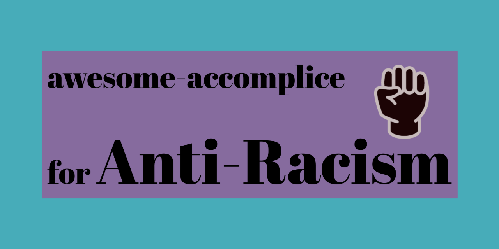

# awesome-accomplice

A list of resources for folks ready to join the path to Racial Justice through anti-racism work.

## About

We are in a time of civil uprising, and though it may feel new to some folks, there are been people doing this work for years and years. Folks who have built methodologies, frameworks, templates, have done research, and built so many resources for folks to better understand the direction we should be headed. It is in that vein that I create this repository, so that we pull from expertise that already exists, we acknowledge and amplify the work that is already being done, and we learn to share, support, then act on this work, so that we may be more aligned in community. 

## Contributing

As I determine how to best fill this repository with resources, please take time to look at resources you have, confirm their source, get consent for them to be shared, and then connect here. I would love support determining how best to organize this resource in a way that is affirming to folks, and centers black voices, especially those who have been doing this work and are leading this work in their communities. 

# Contents

- [Featured](#featured)
- [FUBU](#fubu)
- [History](#history) _"I want to learn"_
- [Funding](#funding) _"I want to give"_
- [Trans,Queer,LGBIA](#trans-queer-lgbia) 
- [Prison/Police Abolition](#prisonpolice-abolition)
- [Business](#business) _"I want to support businesses"_
- [Tech](#tech) _"I want to build/contribute"_
- [Business Practices](#business-practices) _"I want to do better in my work"_
- [Interpersonal Communication](#interpersonal-communication) _"I want to grow & speak with friends/family"_
- [Local Community](#local-community) _"I want to engage with my local community"_
- [To Listen](#to-listen)
- [To Read](#to-read)
- [To Watch](#to-watch)
- [To Follow](#to-follow)

## Featured
  - [OneAction.today Anti-racist newsletter](oneaction.today) - A newsletter dedicated to accountability and support by sharing one concrete, anti-racist action you can take each day—for example, a petition to sign or an email to send to a congressperson. Created by Lateesha Thomas, and Amy Wibowo.
  - [Deconstruction: Anti-Racist Media & Action Guide ](https://deconstruction.club/) - An anti-racist media guide to help small groups have meaningful discussions and connect what they read/watch to concrete actions, created by [Kara Gates](https://twitter.com/karagates)
  - [Black Lives Matter Resource list](https://blacklivesmatter.carrd.co/) - A resource list being maintained by Afro-Latinx artist [nik](https://nikole.carrd.co/)
  - [pb-resources](http://www.pb-resources.com/) - A website built by [Alexis Williams(@alexisdenisew)](https://twitter.com/alexisdenisew) a black CS major at NYU who built this education and resource tool for folks to get engaged in the BlackLivesMatter movement.
  - [tools for activism](https://github.com/drewrwilson/toolsforactivism) - Another awesome list that is dedicated to gathering tools for activist work.
  - [awesome-diversity](https://github.com/folkswhocode/awesome-diversity) - Another awesome list that is focused on resources for making Tech more diverse.
  
  
## History
  - [blackfacts.com](https://blackfacts.com/) - BlackFacts.com endeavors to become the premiere online repository of black culture both nationally and internationally.
  
## Funding
  - [List of places to donate](https://docs.google.com/spreadsheets/u/0/d/1p7QxOvtvRfHUoMWib8coGHSS8szENXzSjIZKpvp-gtA/htmlview#) - A list of organizations and community groups to donate to.

## Trans, Queer, LGBIA

## Prison/Police Abolition
  - [defund12](https://github.com/defund12/defund12.org) - Defund12.org provides shareable links to email the government officials in your community and demand action towards defunding police departments in favor of education, social services, and efforts towards dismantling racial injustice.
  - [8toAbolition](https://www.8toabolition.com/) - A response to defunct/problematic CampaignZero's `#8cantwait` campaign, focused on a list of demands targeted toward city and municipal powers, to abolish police system, and instead, fund communities to thrive.
  - [PrisonCulture Blog](http://www.usprisonculture.com/blog/about/) Mariame Kaba's blog about the Prison Industrial Complex.

## Business
  - [Rebuild Black Business](https://www.rebuildblackbusiness.com/) - An open source project with over 14k black-owned businesses listed, and opportunities for allies to support them.

## Tech
  - [Data For Black Lives](http://d4bl.org/) - A movement of activists, organizers, and mathematicians committed to the mission of using data science to create concrete and measurable change in the lives of Black people.
  - [Citizens Police Data Project](https://beta.cpdp.co/) - A Data project by [Invisible Institute](https://invisible.institute/) that collects and publishes information about police misconduct in Chicago.
  - [Self defined app](https://www.selfdefined.app/) - A resource around vocabulary, created by [Tatiana Mac](https://twitter.com/TatianaTMac), that seeks to provide more inclusive, holistic, and fluid definitions to reflect the diverse perspectives of the modern world. 

## Business practices
  - [Resources for Racial Justice in Research/Design](http://tinyurl.com/UXRRR) - A resource compiled by [Theo Shure](https://www.linkedin.com/in/theo-shure/) around issues of / responsibility to racial justice, focused on the tech research/design field.

## Interpersonal Communication
  - [Beware of Burnout: Sustainable strategies for activism](https://tatianamac.com/posts/beware-of-burnout) - A guide for non-black folks created by [Tatiana Mac](https://tatianamac.com/about) dedicated to folks who are committing to making systemic change.

## Local Community

### Chicago
  - [Local Community orgs to support/fund](https://www.instagram.com/p/CA_ZRu9BOPh/?igshid=ght7ows3lrj1) - A thread of photos listing Local Chicago organizations to fund, as Chicago Community Bond Fund has met it's financial goals.
  - [Invisible Institute](https://invisible.institute/) -  A journalism production company on the South Side of Chicago that works to enhance the capacity of citizens to hold public institutions accountable. Creator of [Citizens Police Data Project](https://invisible.institute/police-data).
  - [Statement from LGBTQ Community Members Regarding CPD Forum](https://docs.google.com/document/d/1UrtZNv2kKxP3sDbrIrNoPNF-ZUH8gMChnEXyYBvM64c/edit) - A statement from members of the trans and queer community of Chicago on the recent forum with CPD superintendent Brown, and why we demand the immediate defunding of CPD.
  
## To Listen
  - [CodeSwitch Podcast](https://www.npr.org/sections/codeswitch/) - An NPR podcast focused on Race and Identity.
  
## To Read
  - [Racial Justice Bookshelf](https://www.racialjusticebookshelf.com/#/books) - A site to find and buy anti-racist books from Black-owned bookstores.
  - [Anti-Racism "action recipe" resource collection](https://www.jamisonclark.org/antiracism) - A collection of actionable activism guides or toolkits, aka action recipes, curated by Jamison Clark, creator of Updraft - The App for Activism.
  - [White Guyde to the Galaxy](https://tatianamac.com/posts/white-guyde) - A resource for White Men from the Guide to Sustainable Change series by Tatiana Mac.
  - [Save The Tears: White Women's Guide](https://tatianamac.com/posts/save-the-tears) - A resource for White Women from the Guide to Sustainable Change series by Tatiana Mac.

## To Watch
  - [Disclosure](https://www.netflix.com/title/81284247) - A documentary where leading trans creatives and thinkers share heartfelt perspectives and analysis about Hollywood's impact on the trans community.
  - [What Happened, Miss Simone?](https://www.netflix.com/title/70308063) - A documentary on the life of Nina Simone

## To Follow
  - [#ActionRecipe Hashtag on Instagram](https://www.instagram.com/explore/tags/actionrecipe/) - A list of over 500 `#actionRecipe` posts on instagram.

## FUBU
